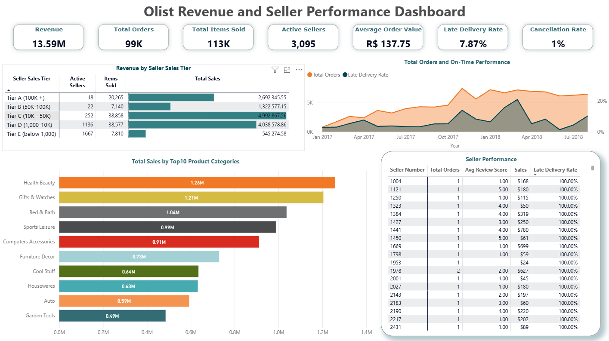

# Olist-Revenue-and-Seller-Performance-Dashboard

This Power BI project analyzes Olist marketplace revenue, seller efficiency, and order dynamics. It highlights end‑to‑end data skills including data cleaning, modeling, DAX, visualization, and generating actionable business insights.

---

# 📌 Overview
This project showcases a Power BI analytics dashboard built using the Olist e‑commerce dataset. The goal is to analyze revenue performance, seller efficiency, and order dynamics across the Olist marketplace. It highlights end‑to‑end data skills including data cleaning, modeling, DAX, visualization, and business insight generation.

---

# 🎯 Objectives
- **Analyze order volume trends** across time and sales tiers to understand how volume impacts late delivery rates  
- **Evaluate seller performance** using KPIs such as order volume, revenue contribution, delivery efficiency, and review scores  
- **Identify top sellers** and uncover growth opportunities  
- **Provide insights** to support marketplace optimization and seller management  

---

## 📊 Key Dashboard Features
- **KPIs:** Total Revenue, Total Orders, Items Sold, Average Order Value, Late Delivery Rate, Cancellation Rate  
- **Seller Performance:** Seller ranking, fulfillment metrics, delivery times, and customer review analysis  
- **Revenue‑Driving Products:** Top product categories and revenue contribution  
- **Interactive Filters:** Explore insights by seller sales tier or evaluate individual sellers  

---

## 🧩 Technical Data Modeling Architecture

### 📐 Star Schema Design & Table Architecture
To ensure a clean analytical layer and high‑performance DAX, the data model was structured using a fully optimized star schema:

- Standardized all tables with **`dim_`** and **`fact_`** prefixes to clearly define table roles and grain  
- Created a dedicated **`_measures`** table to centralize all DAX measures and maintain a clean semantic layer  
- Added a **`_date`** table with a continuous calendar, fiscal attributes, and full time‑intelligence support  
- Built a custom **`dim_tier_ranking`** table to classify sellers into revenue‑based tiers for segmentation and ranking logic  
- Established **one‑to‑many relationships** from all dimension tables to their corresponding fact tables  
- Enforced **single‑direction filter propagation** to avoid ambiguous filter paths and maintain model clarity  
- Connected the `_date` table to all time‑dependent fact tables using the primary date key  
- Validated cardinality and granularity alignment across all relationships to ensure accurate aggregation behavior  

---

### 🧱 Calculated Columns & Structural Enhancements
Several calculated columns were engineered to support segmentation, improve usability, and enhance analytical depth:

- - **`seller_sales`** column added to `dim_sellers` to support tier classification and seller‑level KPIs.
- **Sequential `seller_number`** column created in `dim_sellers` to replace long alphanumeric seller IDs, improving visual readability and slicer usability.
- Cleaned and standardized English translations in `dim_product_category_english` to ensure accurate category labels in visuals.
- Ensured all dimension tables contain clean surrogate keys and well‑structured attributes for reliable slicing and grouping.

---

# 🛠️ Tech Stack
* **Power BI Desktop:** Data modeling, DAX, and visualization.
* **Power Query:** Data cleaning & transformation.
* **GitHub:** Version control & portfolio presentation.
* **Olist Public Dataset:** Sourced from Kaggle.

---

# 📂 Repository Structure
```text
Code /Olist-Dashboard
 │── /visuals           # Screenshots & visuals
 │── /pbip-project      # Power BI project files
 │── README.md
```

---

# 📸 Dashboard Preview



---

# 🔍 Key Insights
* **Top Sellers** contribute a significant share of total marketplace revenue. The highest revenue generating sellers are not the top "Tier A (100K +)" sellers; rather, the top sales generators are those selling in the "Tier C (10K-50K)" and Tier D (1,000 - 10K) sales range.
* **Health and Beauty** category drives the highest overall revenue.
* **Opportunity for Growth** Targeted seller fee discounts to sellers in Tier E or Tier D may provide incentives to increase sales and possibly move up in sales tiers, increasing overal revenue.
* **Opportunity for Increased Customer Satisfaction** There may be an opportunity to increase customer satisfaction by removing underselling performers with low satisfaction rates and 100% late delivery rates from the marketplace.

---

# 📥 How to Use
1. **Clone** or download this repository.
2. **Open** the `.pbip` file in Power BI Desktop.
3. **Explore** the interactive dashboard elements.

---

# 🏁 Conclusion
This project demonstrates strong analytical capabilities across the full data lifecycle — from cleaning and modeling to visualization and insight generation. It serves as a portfolio piece showcasing the ability to turn raw marketplace data into meaningful business intelligence.
